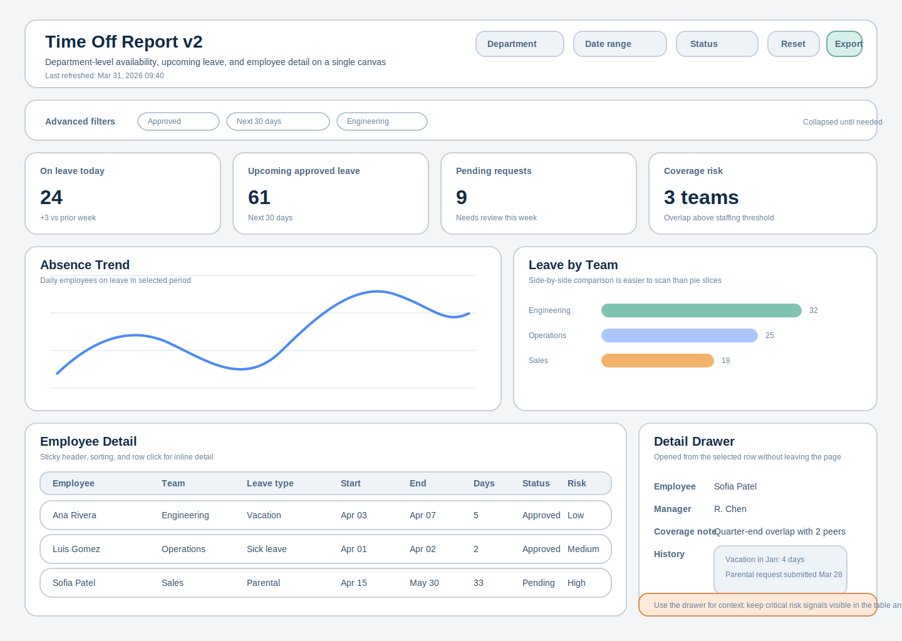

# RDSP-219: Time Off Report Redesign Research

## Scope
This document summarizes BI and UX research for redesigning the Time Off Report flow:
- Step 1: select department
- Step 2: review and filter time off data, including per-user detail

It includes:
- Recommended layout patterns from BI best practices
- Recommended UX updates for filters, navigation, and data table usage
- An example layout asset for design discussion

## Research Summary
The most consistent guidance across Power BI and Tableau is:
- keep dashboards focused on monitoring, not full-detail exploration
- place the highest-priority information in the top-left and top area
- reduce clutter and visual variety
- use charts that support accurate comparison (bar/column over circular charts for value comparison)
- support interactive filtering without forcing navigation away from the report

Accessibility guidance (WCAG) also requires:
- text contrast of at least `4.5:1` for normal text, `3:1` for large text
- non-text UI components and chart elements with sufficient contrast (`3:1`)
- avoid conveying meaning with color alone

## Source-Based Design Principles
1. One-screen narrative with clear hierarchy  
Power BI recommends showing key information at a glance on one screen and reducing clutter, while placing important content where users scan first (top/left areas). Tableau mirrors this by advising that the most important view occupy the upper-left and that dashboards limit the number of views for clarity and performance.

2. Dashboard first, details second  
Power BI explicitly frames dashboards as an overview and suggests leaving detail for drill-in/report layers. For this report, this means the main page should emphasize coverage risk and trend signals, with row-level detail available via inline drawer or drill-through.

3. Comparison-friendly chart choices  
Power BI guidance warns against hard-to-compare visuals (notably circular chart types for many comparison tasks) and recommends bar/column for side-by-side comparisons. Time-off by team/type should default to sortable bars and trend lines.

4. Intentional filtering and interactions  
Tableau guidance emphasizes visible, configurable filters and clear interaction labels. Filters should remain easy to understand, with active state chips and one-click reset to avoid “unknown filter state” confusion.

5. Mobile-first adaptation rules  
Power BI mobile guidance recommends prioritizing only important visuals, avoiding side-by-side dense layouts, and preserving top-to-bottom narrative flow. The redesigned report should have a dedicated mobile arrangement, not just auto-resized desktop composition.

6. Accessibility as a first-class requirement  
WCAG guidance requires contrast thresholds and non-color status encoding. For this report, leave status/risk indicators as icon + text + color, and ensure focus styles for keyboard navigation in filters/table rows.

## Recommended IA and Layout
## Proposed Structure
1. Global header row
- Report title
- Last refresh time
- Primary filters (Department, Date range, Status)
- Actions (Reset filters, Export)

2. KPI summary row
- On leave today
- Approved upcoming leave (next 30 days)
- Pending requests
- Coverage risk teams

3. Analytical row
- Left: Absence trend over time (line/area)
- Right: Leave by team/type (bar chart)

4. Detail row
- Sortable and filterable employee table
- Row selection opens right-side detail drawer (without page change)

## Why This Layout
- It aligns with top-down scan behavior and BI “overview first” design.
- It reduces step-switching overhead by keeping context, filters, and details in one canvas.
- It supports both manager workflows (monitoring risk) and analyst workflows (investigating specific users).

## Recommended UX Updates
1. Replace hard step transition with persistent context
- Keep “selected department” visible as a locked filter chip in header.
- Users should not feel they are on a different tool after department selection.

2. Add explicit filter-state communication
- Show active filter chips below header.
- Include “Reset all” and per-chip clear action.
- Show result count (for example: “42 employees shown”).

3. Improve table usability
- Sticky header, sortable columns, sensible defaults (for example upcoming start date ascending).
- Column set focused on actionability: employee, team, type, start, end, days, status, coverage risk.
- Row click opens detail drawer; do not navigate away for common inspection tasks.

4. Strengthen risk signaling
- Add derived fields such as “overlap risk” and “team capacity warning”.
- Use severity badges with text labels (`Low`, `Medium`, `High`) instead of color-only indicators.

5. Mobile behavior
- Dedicated mobile layout with stacked blocks.
- Keep KPIs and one trend chart first; collapse table to condensed cards with “open full table” action.

6. Accessibility checklist for implementation
- Text contrast >= `4.5:1`, large text >= `3:1`.
- Non-text controls/graphical marks contrast >= `3:1` where required.
- Keyboard reachable filters, table rows, and drawer controls.
- Color not used as sole status/risk indicator.

## Example Layout Asset
- Example wireframe SVG: `docs/assets/time_off_report_layout_example.svg`

Preview in markdown-compatible viewers:

## Implementation Plan (Suggested)
1. Discovery and metric alignment
- Confirm KPI definitions (for example what counts as “coverage risk”).
- Confirm required user personas (HR admin, manager, department lead).

2. Low-fidelity prototype
- Validate one-screen hierarchy and filter semantics.
- Validate top 5 manager tasks with clickable prototype.

3. Build iteration
- Implement shell layout + filter model first.
- Add KPI cards and charts.
- Integrate table + drawer interaction.

4. Validation
- Usability session with managers (task success and time-to-insight).
- Accessibility QA (contrast and keyboard navigation).
- Performance checks for large departments.

## Success Metrics
- Time to answer “Who is out and where is risk?” reduced by at least 30%.
- Filter usage adoption above 60% in first month.
- Reduction in navigation steps per investigation flow.
- Accessibility checks pass for contrast and keyboard operation.

## Sources
1. Power BI dashboard design tips (Microsoft Learn):  
https://learn.microsoft.com/en-us/power-bi/create-reports/service-dashboards-design-tips

2. Tableau dashboard best practices:  
https://help.tableau.com/current/pro/desktop/en-us/dashboards_best_practices.htm

3. Power BI mobile-optimized report best practices:  
https://learn.microsoft.com/en-us/power-bi/create-reports/power-bi-create-mobile-optimized-report-best-practices

4. WCAG 2.1 contrast minimum (W3C):  
https://www.w3.org/WAI/WCAG21/Understanding/contrast-minimum

5. WebAIM contrast and use-of-color interpretation:  
https://webaim.org/articles/contrast/
