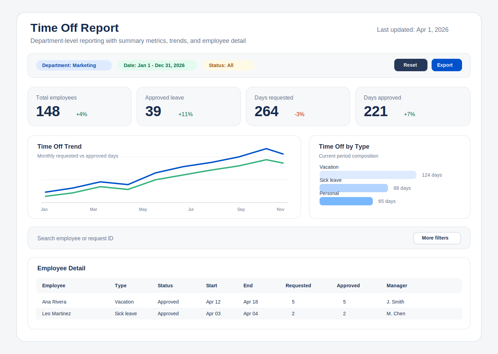

# Time Off Report Redesign Research

## Objective

This document summarizes recommended BI-style layout and UX patterns for redesigning the Time Off Report described in `RDSP-219`.

Current flow from the ticket:

1. Step 1: user selects a department.
2. Step 2: user views the report for that department, uses filters, and inspects data by user.

The redesign goal should be to reduce friction, surface the most important findings earlier, and keep detailed employee-level analysis available without overwhelming the page.

## Research Summary

Across modern BI and enterprise reporting guidance, the same themes repeat:

- Put the highest-value information in the upper-left and top row.
- Keep the page to one clear story instead of many equal-priority widgets.
- Use a single, predictable filter area instead of scattering controls across the screen.
- Provide summary first, detail second.
- Give dense tables space, sorting, search, and progressive disclosure rather than forcing everything into charts.
- Design for the real display size and mobile constraints instead of assuming one desktop layout fits all.

These recommendations are consistent across Tableau, Power BI, SAP Fiori, Carbon Design System, and Atlassian Design guidance.

## Recommended Information Architecture

The best fit for a Time Off Report is a **summary-first operational dashboard with a detail table**.

Recommended structure:

1. Persistent page header
2. Filter bar
3. KPI summary row
4. Primary visual insights row
5. Detailed employee table
6. Optional drill-in panel or row expansion for employee details

This is a better fit than a two-step wizard-like flow because department selection is not a separate task; it is the report's primary filter.

## Recommended Layout

### 1. Header

Use a single page title such as `Time Off Report`, plus a compact subtitle with:

- selected date range
- selected department
- last refresh timestamp
- data source note if applicable

This follows BI guidance to provide context for what the user is seeing before they interpret the numbers.

### 2. Filter Bar

Place filters in one dedicated horizontal bar directly below the header.

Recommended filters:

- Department
- Date range
- Time-off type
- Status
- Employee search
- Manager or team lead, if the data supports it

Recommended behavior:

- Treat `Department` and `Date range` as default visible filters
- Keep advanced filters collapsible under `More filters`
- Show active filter chips and a `Reset` action
- Avoid duplicate filtering inside the table when the page already has a global filter bar

This aligns with SAP Fiori guidance to provide one central filter location for tables and reports.

### 3. KPI Summary Row

Use 4 compact summary cards across the first visible row:

- Total employees in scope
- Employees with approved time off
- Total days requested
- Total days approved

Optional fifth KPI if useful:

- Upcoming absences in next 30 days

Each KPI should include context, not only a number. Good examples:

- current period vs previous period
- approved vs requested
- percent of team with upcoming leave

### 4. Primary Insight Row

Use two or three high-value visuals, not a crowded dashboard.

Recommended visual set:

- Line or bar chart: time off trend by month or week
- Stacked bar chart: time off by type
- Calendar or heatmap-like view: peak absence periods by month/week

Why this mix works:

- trend answers "when is time off happening?"
- category split answers "what kind of time off is driving volume?"
- density/heatmap answers "where are staffing pressure periods?"

Avoid pie or donut charts unless there are very few categories and part-to-whole is the only question.

### 5. Detail Table

Below the summary visuals, keep a wide, scannable employee table for operational work.

Recommended columns:

- Employee
- Department
- Manager
- Time-off type
- Status
- Start date
- End date
- Days requested
- Days approved
- Remaining balance, if available

Recommended table behaviors:

- sortable columns
- sticky header
- search
- pagination or virtualized scrolling
- zebra striping or strong row hover state
- right-aligned numeric values
- row expansion or side panel for full request history

If actions exist later, place them in a toolbar above the table, not inside every cell.

## Recommended UX Updates

### Replace the two-step flow

Do not force users to "select a department" on one screen and then load a separate reporting screen unless data volume makes that technically necessary.

Preferred approach:

- load the report page directly
- prefill department from the user's last selection, default team, or route parameter
- let users change department in the filter bar

This reduces clicks and makes the report feel like a report, not a wizard.

### Use progressive disclosure

Keep the first screen focused on decisions:

- summary KPIs
- one trend view
- one composition view
- one detailed table

Push lower-frequency details behind:

- row expansion
- side panel drill-ins
- collapsible advanced filters

### Make the hierarchy explicit

Use visual weight intentionally:

- largest emphasis for the most important KPI or trend
- medium emphasis for supporting visuals
- neutral styling for the data table until the user needs detail

Do not give every chart the same size and color intensity.

### Design for real-world scanning

Users should be able to answer these questions in under 10 seconds:

- Which department am I viewing?
- What period is this report showing?
- Are absences up or down?
- Which time-off type is driving the most volume?
- Which employees have upcoming or approved leave?

If the layout does not answer those quickly, it is still too dense.

### Support accessibility and readability

- Prefer high-contrast text and restrained color use
- Do not rely on red/green alone to indicate status
- Use labels, icons, or text deltas in addition to color
- Keep chart labels horizontal where possible
- Use sentence-case titles and concise labels

## Proposed Layout for This Report

This is the recommended desktop layout:

```text
---------------------------------------------------------------
Time Off Report                           Last updated: Apr 2026
Department: Marketing   Date: Jan-Dec 2026   Status: All
---------------------------------------------------------------
[ Total Employees ] [ Approved Leave ] [ Days Requested ] [ Days Approved ]

[ Time Off Trend ---------------------- ] [ Time Off by Type ----------- ]
[ Peak Absence Periods --------------- ] [ Key callouts / exceptions --- ]

Search employee...
[ Employee detail table ----------------------------------------------- ]
```

For smaller screens:

- stack KPI cards vertically or in two columns
- place filters before visuals
- show one chart per row
- keep the table below charts with reduced visible columns

## Why This Layout Is Recommended

This structure matches common BI dashboard reading patterns:

- **top-left and top row** hold the most important context and KPI signals
- **middle section** tells the main story with 2-3 focused visuals
- **bottom section** provides operational detail in a table

It also fits the specific use case better than a chart-only dashboard because time-off analysis usually requires both aggregate understanding and employee-level inspection.

## Suggested UI Components

If the team wants a concrete component list, the page can be built from:

- page heading
- filter bar with chips
- KPI stat cards
- bar/line charts
- optional heatmap
- data table with sort and pagination
- empty state and no-results state

Useful micro-interactions:

- hover tooltip on KPIs with metric definitions
- click a chart segment to cross-filter the table
- save filter preset for frequent department/date combinations
- export current filtered view

## Recommendation Set

### Recommended v1

- Single report page instead of separate department-selection step
- One centralized filter bar
- Four KPI cards at the top
- Two to three core visuals only
- Employee-level table below the visuals
- Responsive behavior for smaller screens

### Recommended v2 enhancements

- saved views or presets
- drill-in drawer for employee leave history
- alerting for peak absence periods
- comparison toggle for previous period or previous year

## Example Mockup

An example concept image is included here:

- 
- [time_off_report_redesign_mockup.svg](./time_off_report_redesign_mockup.svg)

## Source Notes

These recommendations were derived from the following sources:

- Tableau: upper-left placement, limited views, audience-first dashboard design  
  https://help.tableau.com/current/pro/desktop/en-us/dashboards_best_practices.htm
- Tableau: layout sizing, tiled vs floating layouts  
  https://help.tableau.com/current/pro/desktop/en-us/dashboards_organize_floatingandtiled.htm
- Tableau: refinement, upper-left emphasis, clutter reduction  
  https://help.tableau.com/current/pro/desktop/en-us/dashboards_refine.htm
- Tableau Blueprint: z-layout/newspaper layout and whitespace guidance  
  https://help.tableau.com/current/blueprint/en-us/bp_visual_best_practices.htm
- Microsoft Power BI: one-screen storytelling, top-left priority, right-chart choices, context, consistency  
  https://learn.microsoft.com/en-us/power-bi/create-reports/service-dashboards-design-tips
- Microsoft Power BI mobile guidance: top-to-bottom story, mobile-specific spacing and layout  
  https://learn.microsoft.com/en-us/power-bi/create-reports/power-bi-create-mobile-optimized-report-best-practices
- SAP Fiori: one central filter location, default filters, collapsed vs expanded filter bar decisions  
  https://www.sap.com/design-system/fiori-design-web/v1-120/ui-elements/filter-bar/usage
- Carbon Design System: data table toolbar, sorting, pagination, row expansion, hover, zebra striping  
  https://carbondesignsystem.com/components/data-table/usage/
- Atlassian Design System: dynamic table as the recommended sortable/paginated enterprise table pattern  
  https://atlassian.design/components/dynamic-table/

## Final Recommendation

The strongest redesign direction is:

- convert department selection into a default report filter
- redesign the page as a single BI-style dashboard
- lead with KPIs and trend insight
- keep a powerful employee table as the operational detail layer

That approach is the most consistent with current business intelligence and enterprise UX guidance, and it best supports both quick scanning and deeper staff-level analysis.
